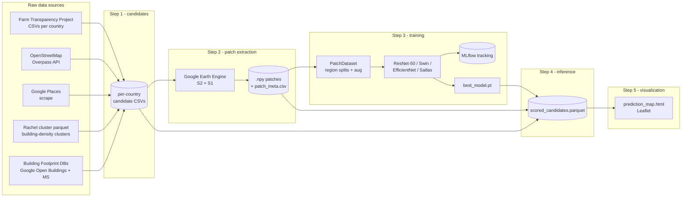
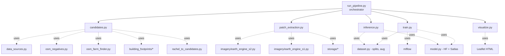
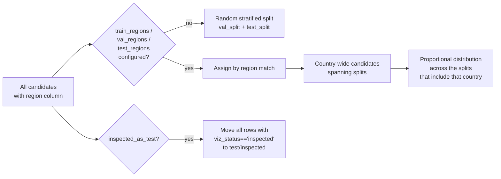
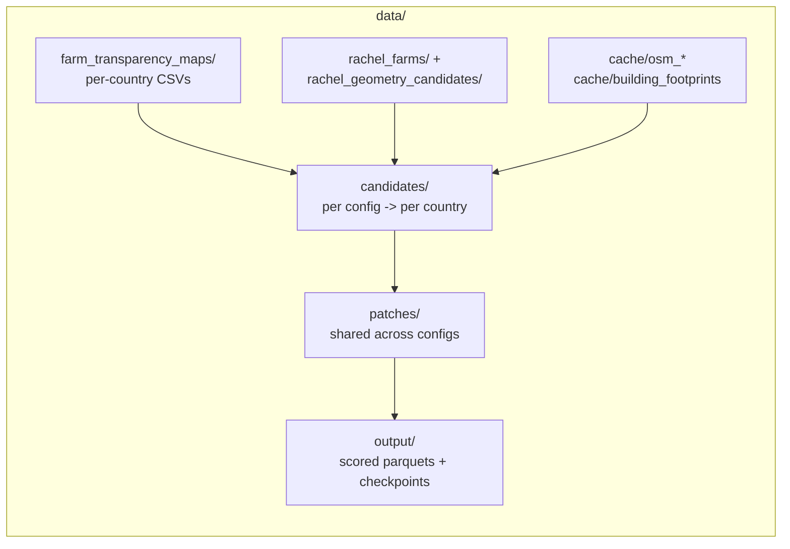
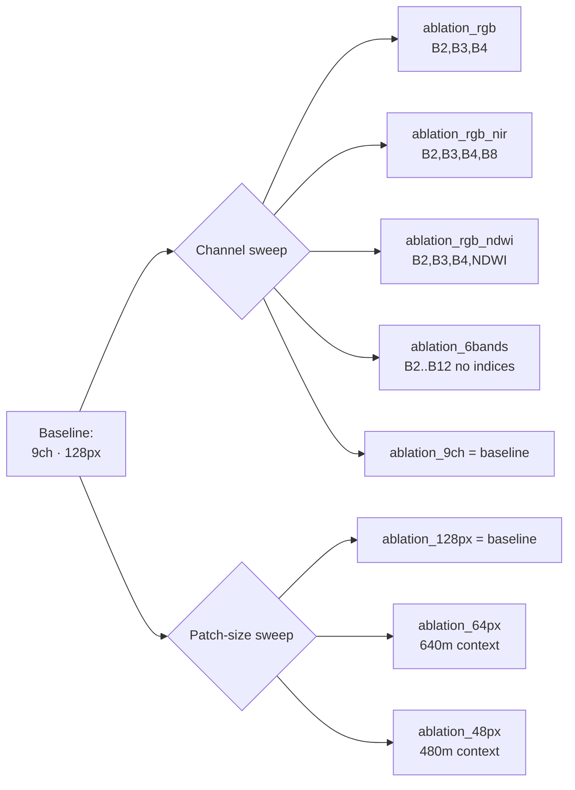

# Farm Mapping — Codebase, Data and Experiments

End-to-end documentation of the satellite-based livestock-farm detection pipeline:
what each module does, what data flows through it, and which experiments have
been run.

> Companion to the top-level [README](../README.md). The README is the
> user-facing quickstart; this document is the reference map.

---

## 1. High-level system map



The pipeline is YAML-config-driven and orchestrated by
[`training/run_pipeline.py`](../training/run_pipeline.py); a single
[`PipelineConfig`](../training/config.py) parameterises every step.

---

## 2. Repository layout

```
farm-mapping/
├── configs/                    # YAML experiment configs (one per run)
│   ├── default.yaml            # Defaults
│   ├── smoke_test.yaml         # Tiny config for local sanity
│   ├── global_all_farms.yaml   # Multi-country, all farm types
│   ├── usa_all_farms_*.yaml    # Architecture sweep on US data
│   ├── chicken_*_*.yaml        # Species/country slices
│   └── rachel_clusters/        # All Rachel-cluster-based experiments
│       ├── rachel_baseline*.yaml      # Baselines + class-weight sweeps
│       ├── rachel_poultry_v1.yaml     # Poultry vs everything else
│       ├── ablation_*.yaml            # Band / patch-size ablations
│       └── baseline_v2_*.yaml         # All-country + multiclass
├── training/                   # All pipeline code (see Section 3)
├── src/                        # Shared utilities (country registry,
│                               #   Earth Engine detection helpers,
│                               #   geometry, visualization)
├── scripts/                    # One-off operational scripts
├── data/                       # Local data (gitignored, see Section 4)
├── output/                     # Prediction maps + checkpoints (latest)
├── mlruns/                     # MLflow tracking store (local)
├── notebooks/                  # Result analysis notebooks (clean)
├── notebooks_local/            # Exploration / data-prep notebooks
├── docs/                       # This file + runpod-storage.md
├── Dockerfile                  # RunPod image build
├── requirements-train.txt      # GPU training deps
├── requirements-cpu.txt        # CPU candidate/patch deps
└── README.md
```

---

## 3. Pipeline modules



### 3.1 Orchestration

| File | Role |
|---|---|
| [`training/run_pipeline.py`](../training/run_pipeline.py) | Runs `candidates → patch_extraction → train → inference → visualize` as subprocesses; manages timestamped run directories and per-step logs. |
| [`training/runpod_launch.py`](../training/runpod_launch.py) | Launches the pipeline on RunPod (CPU pods for prep steps, GPU pod for training). Three modes: `--prep` (candidates), `--patches`, default (train+inference+visualize). |
| [`training/auto_terminate.py`](../training/auto_terminate.py) | Self-terminates the RunPod pod after the script finishes. |
| [`training/env_loader.py`](../training/env_loader.py) | Loads `.env` and inline RunPod secrets (Earth Engine, Google Maps, RunPod API). |

### 3.2 Step 1 — Candidate generation

| File | Role |
|---|---|
| [`training/candidates.py`](../training/candidates.py) | Top-level builder. Combines positives + negatives (configurable strategy), assigns the `region` column used for splits. |
| [`training/rachel_to_candidates.py`](../training/rachel_to_candidates.py) | Converts a Rachel building-cluster parquet into per-country candidate CSVs. Supports `binary`, `poultry` and `multiclass` (7-class) label modes. |
| [`training/osm_negatives.py`](../training/osm_negatives.py) | Fetches non-farm buildings (warehouses, hangars, industrial) via Overpass; caches per region. |
| [`training/osm_farm_finder.py`](../training/osm_farm_finder.py) | Discovers OSM-tagged farms and classifies species via keyword matching. |
| [`training/building_footprints/labeler.py`](../training/building_footprints/labeler.py) | Cross-references building footprints with FTP / OSM to produce harder positives and negatives. |
| [`training/building_footprints/providers.py`](../training/building_footprints/providers.py) | Google Open Buildings v3 and MS Global ML Building Footprints providers (via EE). |
| [`training/building_footprints/osm_enrichment.py`](../training/building_footprints/osm_enrichment.py) | Tiled Overpass enrichment of building tags. |
| [`training/building_footprints/taxonomy.py`](../training/building_footprints/taxonomy.py) | Unified taxonomy mapping (FTP categories, OSM tags) → canonical labels. |

**Output schema** (`data/candidates/<config>/<country>.csv`):
`id, name, lat, lng, species, category, source, country, state, label, region,
viz_status, num_bldgs, total_area_m2, median_area, template_score_if`

### 3.3 Step 2 — Patch extraction

| File | Role |
|---|---|
| [`training/patch_extraction.py`](../training/patch_extraction.py) | Pulls Sentinel-2/Sentinel-1 patches via Earth Engine `computePixels`; stacks multi-provider bands; writes `.npy` files + `patch_meta.csv`. Resumes via the meta CSV. |
| [`training/imagery/base.py`](../training/imagery/base.py) | Provider protocol + `ResolvedSource` wrapper. |
| [`training/imagery/earth_engine_s2.py`](../training/imagery/earth_engine_s2.py) | Sentinel-2 SR median (or least-cloudy) composite, bands + spectral indices (NDVI, NDBI, NDWI). |
| [`training/imagery/earth_engine_s1.py`](../training/imagery/earth_engine_s1.py) | Sentinel-1 GRD IW median composite (VV, VH). |
| [`training/storage/base.py`](../training/storage/base.py) | StorageBackend protocol. |
| [`training/storage/local.py`](../training/storage/local.py) | Local filesystem backend. |
| [`training/storage/gcs.py`](../training/storage/gcs.py) | Google Cloud Storage backend. |
| [`training/storage/s3.py`](../training/storage/s3.py) | AWS S3 backend. |

Each patch is `(C, H, W)` `float32`. The default S2 stack is **9 channels**
(`B2, B3, B4, B8, B11, B12, NDVI, NDBI, NDWI`) at 128×128 px / 10 m → 1.28 km
context.

`patch_meta.csv` is a global registry shared across configs. Re-runs skip
already-extracted patches keyed by `(candidate_id, imagery_config_hash)`.

### 3.4 Step 3 — Training

| File | Role |
|---|---|
| [`training/train.py`](../training/train.py) | Training loop. Mixed precision, cosine/step/plateau schedulers, early stopping, class weights, weighted samplers, MLflow logging, evaluates on test + optional inspected held-out set. |
| [`training/dataset.py`](../training/dataset.py) | `PatchDataset` (.npy loader, augmentation pipeline) + `build_splits` (region-based train/val/test). Supports channel sub-setting (`channel_subset`) and center cropping (`crop_center_px`) — both used for ablations. |
| [`training/model.py`](../training/model.py) | HuggingFace + Satlas model builder. Adapts the first conv to N input channels (replicates RGB weights), replaces the classification head, supports backbone freezing. |
| [`training/config.py`](../training/config.py) | Pydantic config schema; `imagery_config_hash`, `cache_key`, `resolve_paths`, `resolve_channel_indices`. |

#### Train / val / test split logic



Sampler options for unbalanced data:

- `upsample_minority_regions` — weight each country equally per epoch.
- `balanced_country_splits` — make val/test counts per country balanced.
- `balanced_class_sampling` — weight classes equally; multiplies with the
  region weight when both are enabled (used by the multiclass run).

#### Augmentation knobs (all toggleable)

`horizontal_flip · vertical_flip · random_rotation_90 · continuous_rotation
· random_resized_crop · brightness_jitter · per_band_jitter · gaussian_noise
· channel_dropout · cutout`. Spectral indices can be recomputed post-aug
(`recompute_indices: true`).

### 3.5 Step 4 — Inference

[`training/inference.py`](../training/inference.py) scores every candidate and
writes `scored_candidates.parquet`:
`candidate_id, lat, lng, country, state, label, region, viz_status,
predicted_score, predicted_label, confidence_tier, [class_<k>_prob …]`.

Confidence tiers are configurable (default `high=0.8, medium=0.5, low=0.3`).
Channel sub-setting and center-cropping are honoured at inference time so the
input matches the training distribution.

### 3.6 Step 5 — Visualisation

[`training/visualize.py`](../training/visualize.py) produces an interactive
Leaflet HTML map with toggleable TP/FP/FN/TN layers (or per-class layers for
multi-class), split filters (train / val / test / inspected), a per-split
metrics panel and per-country breakdowns.

### 3.7 Shared modules under `src/`

| File | Role |
|---|---|
| [`src/config.py`](../src/config.py) | `COUNTRIES` registry (display name + FTP CSV path + species filter), `DetectionParams`, Earth Engine init helpers. |
| [`src/data_sources.py`](../src/data_sources.py) | Pluggable loaders returning a unified GeoDataFrame schema (Farm Transparency, OSM, Google Open Buildings). |
| [`src/detection.py`](../src/detection.py) | Earth Engine detection methods (NDBI, MetalRoof, SAR, DynamicWorld, GoogleOpenBuildings). |
| [`src/geometry.py`](../src/geometry.py) | EE + client-side geometry utilities (area, aspect ratio, KDTree dedup, tiling). |
| [`src/pipeline.py`](../src/pipeline.py) | Per-tile detection orchestration (used by legacy notebook flow). |
| [`src/visualization.py`](../src/visualization.py) | Reusable Leaflet map generation (legacy, complements `training/visualize.py`). |

---

## 4. Data layout



### 4.1 Source CSVs and parquets

| Path | Contents |
|---|---|
| `data/farm_transparency_maps/All facilities in *.csv` | Raw Farm Transparency Project drops, one CSV per country (~41 countries on disk, e.g. United States, Brazil, Thailand, India, Argentina). |
| `data/rachel_farms/*.parquet` | Older single-country cluster files (Chile, Thailand). |
| `data/rachel_geometry_candidates/all_countries/all_clusters.parquet` | **Current master cluster dataset.** 101,795 building clusters across 167 ADM0 codes (top: USA 35.9k, BRA 21.2k, IND 9.0k, MEX 7.3k, THA 5.8k). 1,580 rows have `viz_status='inspected'`. |
| `data/rachel_geometry_candidates/selected_clusters_relabeled.parquet` | Previous-generation filtered+relabeled clusters (71,322 rows, USA/BRA/MEX/THA/CHL). Used by all `ablation_*` and `rachel_baseline*` configs. |
| `data/rachel_geometry_candidates/cluster_map.html` | Pre-built map of clusters. |
| `data/rachel_geometry_candidates/osm_raw/` | Cached Overpass responses. |

### 4.2 Label distribution in `all_clusters.parquet`

| Label | Count |
|---|---:|
| (unlabeled) | 86,181 |
| Farm: Poultry: Unspecified/Other | 6,191 |
| NotFarm | 3,623 |
| Farm: Poultry: Meat Chickens | 2,382 |
| Farm: Pigs | 1,994 |
| Farm: Poultry: Eggs | 612 |
| Farm: Unknown | 353 |
| Farm: Cattle | 174 |
| Ambiguous | 102 |
| Farm: Mixed | 87 |
| Farm: PigsOrPoultry | 78 |
| Farm: Other | 18 |

The multiclass label map (`rachel_to_candidates.py`):

| Class | Source label(s) |
|---|---|
| 0 NotFarm | `NotFarm` |
| 1 Poultry: Meat | `Farm: Poultry: Meat Chickens` |
| 2 Poultry: Eggs | `Farm: Poultry: Eggs` |
| 3 Poultry: Other | `Farm: Poultry: Unspecified/Other` |
| 4 Pigs | `Farm: Pigs` |
| 5 Cattle | `Farm: Cattle` |
| 6 Other | `Mixed`, `Other`, `Unknown`, `PigsOrPoultry` |

### 4.3 Candidate directories

| Directory | Configs that consume it |
|---|---|
| `data/candidates/` | Legacy FTP/OSM flows (currently `thailand.csv`). |
| `data/rachel_geometry_candidates/candidates/` | 5-country selected dataset (brazil, chile, mexico, thailand, united_states). |
| `data/rachel_geometry_candidates/candidates_inspected_all/` | Inspected-only export for inference runs. |
| `data/rachel_geometry_candidates/candidates_multiclass/` | 51 country CSVs derived from `all_clusters.parquet` with multiclass labels. |
| `data/rachel_geometry_candidates/candidates_poultry/` | Poultry-mode export. |

### 4.4 Patches store

`data/patches/` is the **shared** Sentinel-2 patch cache, layout
`{country}/{state-or-nan}/{imagery_hash}/{candidate_id}.npy`. Currently
contains patches for 53 country directories (AFG, AGO, BDI, BFA, BGD, Brazil,
BWA, Canada, Chile, …, United States, YEM, ZMB, ZWE) plus the global
`patch_meta.csv` registry.

`patch_meta.csv` columns:
`candidate_id, lat, lng, state, n_channels, height, width,
clear_pixel_fraction, patch_path, imagery_config_hash, bands, date_range,
composite, provider`.

### 4.5 Country registry (canonical keys in `src/config.py`)

`thailand · united_states · united_kingdom · brazil · australia · mexico ·
chile · argentina · south_africa · canada · germany`. Plus Rachel-cluster
ADM0 codes that are mapped at conversion time
(`USA→united_states`, `BRA→brazil`, …); unknown ADM0 codes pass through as
lowercase (`AFG→afg`, etc.).

### 4.6 Output directory

| Path | Meaning |
|---|---|
| `output/best_model.pt` | Convenience symlink-like copy of the latest checkpoint. |
| `output/maps_<config>/prediction_map.html` | Latest Leaflet map per config. |
| `data/output/<config>/scored_candidates.parquet` | Inference scores per config. |
| `data/output/<config>/training_metrics.json` | Test-set metrics. |
| `data/output/<config>/inspected_metrics.json` | Held-out inspected-set metrics. |
| `data/output/<config>/best_model.pt` | Per-config archived checkpoint. |
| `output/thailand_test_map.html`, `output/demo_prediction_map.html` | Legacy demo artefacts. |

---

## 5. Experiments

All experiments share the same pipeline; they differ only in the YAML config.
Each row below corresponds to one config in `configs/`.

### 5.1 Global / single-country baselines

| Config | Run name | Data | Model | Notes |
|---|---|---|---|---|
| [`configs/global_all_farms.yaml`](../configs/global_all_farms.yaml) | `resnet50_global_v1` | Multi-country FTP positives + random/OSM negatives | ResNet-50, 9ch, 128px | LR 5e-5, country upsampling. The reference multi-country baseline. |
| [`configs/usa_all_farms.yaml`](../configs/usa_all_farms.yaml) | `resnet50_all_farms_v1` | United States only | ResNet-50 | LR 1e-4. |
| [`configs/usa_all_farms_bfd.yaml`](../configs/usa_all_farms_bfd.yaml) | `resnet50_bfd_v1` | US, building-footprint candidates | ResNet-50 | Tests harder negatives sourced from real building polygons. |
| [`configs/chicken_meat_united_states.yaml`](../configs/chicken_meat_united_states.yaml) | — | US chicken-meat slice | ResNet-50 | 1 epoch — smoke run. |
| [`configs/chicken_meat_thailand.yaml`](../configs/chicken_meat_thailand.yaml) | — | Thailand chicken-meat | ResNet-50 | 30 epochs. |
| [`configs/chicken_eggs_united_states.yaml`](../configs/chicken_eggs_united_states.yaml) | — | US egg farms | ResNet-50, bs=16, LR=5e-5 | Smaller LR for stable fine-tuning. |
| [`configs/chicken_eggs_us_satlas.yaml`](../configs/chicken_eggs_us_satlas.yaml) | — | US egg farms | Satlas pretrained encoder | LR 3e-5 — pretrained features are strong. |
| [`configs/smoke_test.yaml`](../configs/smoke_test.yaml) | — | Tiny | — | Local sanity check. |

### 5.2 Architecture sweep on US data

All on `united_states`, same data, 50 epochs.

| Config | Architecture | HF hub | BS | LR |
|---|---|---|---:|---:|
| [`usa_all_farms.yaml`](../configs/usa_all_farms.yaml) | resnet50 | `microsoft/resnet-50` | 32 | 1e-4 |
| [`usa_all_farms_convnext.yaml`](../configs/usa_all_farms_convnext.yaml) | convnext_tiny | `facebook/convnext-tiny-224` | 32 | 1e-4 |
| [`usa_all_farms_efficientnet.yaml`](../configs/usa_all_farms_efficientnet.yaml) | efficientnet_b0 | `google/efficientnet-b0` | 64 | 1e-4 |
| [`usa_all_farms_swin.yaml`](../configs/usa_all_farms_swin.yaml) | swin_tiny | `microsoft/swin-tiny-patch4-window7-224` | 32 | 5e-5 |
| [`usa_all_farms_satlas.yaml`](../configs/usa_all_farms_satlas.yaml) | resnet50_satlas | `SENTINEL2_SI_MS_SATLAS` | 32 | 1e-4 |

### 5.3 Rachel clusters — baselines & class-weight sweep

Data source: `selected_clusters_relabeled.parquet` (71k clusters), with
`inspected_as_test: true` so the 1,157 inspected clusters become a held-out
test set. Country-weighted sampling (`upsample_minority_regions: true`)
throughout.

| Config | Run | Variant |
|---|---|---|
| [`rachel_clusters/rachel_baseline.yaml`](../configs/rachel_clusters/rachel_baseline.yaml) | `baseline_v2` | 4ch (B2/B3/B4/NDWI), 64-px center crop, no class weight. |
| [`rachel_clusters/rachel_baseline_cw.yaml`](../configs/rachel_clusters/rachel_baseline_cw.yaml) | `baseline_cw` | + `class_weight: [1.0, 1.5]` (penalise missed farms). |
| [`rachel_clusters/rachel_baseline_cw_rev.yaml`](../configs/rachel_clusters/rachel_baseline_cw_rev.yaml) | `baseline_cw_rev` | + `class_weight: [1.5, 1.0]` (penalise FPs). |
| [`rachel_clusters/rachel_clusters.yaml`](../configs/rachel_clusters/rachel_clusters.yaml) | `resnet50_rachel_v1` | First-generation Rachel run. |
| [`rachel_clusters/rachel_clusters_v2.yaml`](../configs/rachel_clusters/rachel_clusters_v2.yaml) | `resnet50_rachel_v2_inspected_test` | v2 with inspected-as-test. |
| [`rachel_clusters/rachel_clusters_inference_all.yaml`](../configs/rachel_clusters/rachel_clusters_inference_all.yaml) | `rachel_inference_all` | Re-runs inference of an existing checkpoint over every cluster. |
| [`rachel_clusters/rachel_bfd_combined.yaml`](../configs/rachel_clusters/rachel_bfd_combined.yaml) | `rachel_bfd_combined_v1` | Mixes Rachel clusters with BFD-derived candidates across 7 countries. |
| [`rachel_clusters/rachel_poultry_v1.yaml`](../configs/rachel_clusters/rachel_poultry_v1.yaml) | `resnet50_poultry_v1` | `label_mode: poultry` (poultry vs everything else). |

### 5.4 Ablation sweeps

All ablations share the same training recipe (`selected_clusters_relabeled`,
50 epochs, ResNet-50, country upsampling, no class weight). They differ on
exactly one axis.



| Config | Knob being varied |
|---|---|
| [`ablation_rgb.yaml`](../configs/rachel_clusters/ablation_rgb.yaml) | 3-channel RGB only |
| [`ablation_rgb_nir.yaml`](../configs/rachel_clusters/ablation_rgb_nir.yaml) | RGB + NIR |
| [`ablation_rgb_ndwi.yaml`](../configs/rachel_clusters/ablation_rgb_ndwi.yaml) | RGB + NDWI (same channel set the v2 baselines later adopted) |
| [`ablation_6bands.yaml`](../configs/rachel_clusters/ablation_6bands.yaml) | All 6 S2 bands, no indices |
| [`ablation_9ch.yaml`](../configs/rachel_clusters/ablation_9ch.yaml) | All 9 channels (reference) |
| [`ablation_128px.yaml`](../configs/rachel_clusters/ablation_128px.yaml) | 128 px = 1.28 km context (reference) |
| [`ablation_64px.yaml`](../configs/rachel_clusters/ablation_64px.yaml) | 64 px center crop = 640 m |
| [`ablation_48px.yaml`](../configs/rachel_clusters/ablation_48px.yaml) | 48 px center crop = 480 m |

### 5.5 Baseline v2 — all clusters & multiclass

Driven by `all_clusters.parquet` (the larger, multi-country master dataset).

| Config | Purpose |
|---|---|
| [`baseline_v2_all_labeled.yaml`](../configs/rachel_clusters/baseline_v2_all_labeled.yaml) | Train on all labelled clusters across all countries. 4ch (B2,B3,B4,NDWI), 64-px crop. |
| [`baseline_v2_all_clusters.yaml`](../configs/rachel_clusters/baseline_v2_all_clusters.yaml) | Same as above but also runs inference on every (incl. unlabelled) cluster. |
| [`baseline_v2_inference_inspected.yaml`](../configs/rachel_clusters/baseline_v2_inference_inspected.yaml) | Inference-only over inspected rows across every country, for hand-validation. |
| [`baseline_v2_multiclass.yaml`](../configs/rachel_clusters/baseline_v2_multiclass.yaml) | 7-class farm-type model. `num_classes: 7`, `balanced_class_sampling: true` × `upsample_minority_regions: true` so sampler weights multiply. Same channels & crop as v2. |

---

## 6. Reproduced experiment results

The `mlruns/` store and `data/output/` directory hold the most recent metrics.
These are the available numbers (read directly from those files — the rest
live on the RunPod network volume).

### 6.1 Rachel baseline (`rachel_baseline`)

`data/output/rachel_baseline/`:

| Split | Accuracy | Precision | Recall | F1 | Loss |
|---|---:|---:|---:|---:|---:|
| Test (held-out region) | 0.936 | 0.941 | 0.980 | **0.960** | 0.211 |
| Inspected (extra eval) | 0.829 | 0.826 | 0.969 | **0.892** | 0.434 |

TP/FP/FN/TN: test `191/12/4/43`; inspected `777/164/25/139`.

### 6.2 Chicken eggs (US v2) — `chicken_eggs_united_states_v2`

MLflow run `rumbling-zebra-237`:

| Metric | Test |
|---|---:|
| Accuracy | 0.895 |
| Precision | 0.588 |
| Recall | 0.909 |
| F1 | 0.714 |
| TP / FP / FN / TN | 10 / 7 / 1 / 58 |

### 6.3 US egg farms v1 (legacy)

Experiment `us_egg_farms_v1`, 4 runs (`dazzling-gnu-669`, `rogue-shrimp-15`,
`skittish-lark-157`, `able-swan-231`). Three of four reproduce
`acc=0.556, f1=0.667, prec=0.571, rec=0.800` — the held-out set is tiny (9
labelled examples), so this is largely a smoke / sanity result that motivated
moving to the larger Rachel-cluster data.

### 6.4 Inference artefacts

Scored parquets exist under `data/output/` for:
- `baseline_v2_all_clusters/scored_candidates.parquet`
- `baseline_v2_all_labeled/scored_candidates.parquet`
- `baseline_v2_inference_inspected/scored_candidates.parquet`
- `rachel_clusters_v2/scored_candidates.parquet`

Visualisations under `output/`:
- `maps_rachel_baseline/`, `maps_rachel_clusters/`, `maps_rachel_clusters_v2/`,
  `maps_rachel_poultry_v1/`, `maps_baseline_v2_all_labeled/`,
  `maps_baseline_v2_all_clusters/`,
  `maps_baseline_v2_inspected_all_countries/`, `maps_chicken_eggs_us/`,
  `maps_smoke/`.

> The Satlas / ConvNeXt / EfficientNet / Swin runs and most multi-country
> baselines were executed on RunPod (see `runpod-storage.md`). Their MLflow
> logs and checkpoints live on the network volume
> `/workspace/farm-mapping/mlruns/`, not in this checkout.

---

## 7. Notebooks (analysis)

Versioned under `notebooks/` (intended for reuse):

| Notebook | Purpose |
|---|---|
| `rachel_clusters_results.ipynb` | Overall metrics, per-country and per-farm-type breakdown, FP/FN deep dive with Google Maps links, morphology vs predictions. |
| `rachel_poultry_results.ipynb` | Configurable: per-split metrics, CNN-prob distributions by class and country, isolation-forest vs CNN-prob comparison, sample patches, inspected breakdown. |
| `poultry_vs_baseline_investigation.ipynb` | Root-cause analysis of why the poultry model (poultry vs everything) underperforms (inspected F1 ≈ 0.64 vs baseline F1 ≈ 0.90); investigates pig/cattle look-alikes. |
| `analyze_predictions.ipynb` | General prediction analysis. |

Exploratory / data-prep notebooks live under `notebooks_local/` (Thailand,
Poland, Brazil, Chile farm collection; Google Places scraping; Earth Engine
quickstarts; the `data_generation_pipeline.ipynb` master flow; etc.).

---

## 8. Configuration reference (cheat sheet)

```yaml
run_name: "my_run"                         # tag for run dirs

data:
  countries: []                            # list of country keys (legacy mode)
  parquet_source: data/.../clusters.parquet  # use Rachel parquet instead
  extra_parquet_sources: []                # merged extras
  include_unlabeled: false                 # for inference-only over unlabeled
  inspected_as_test: true                  # viz_status=='inspected' -> test
  inspected_only: false                    # filter parquet to inspected only
  label_mode: binary | poultry | multiclass
  exclude_labels: []                       # drop rows with these labels
  exclude_osm_farms: false                 # drop noisy OSM-tagged farms
  train_regions / val_regions / test_regions: optional explicit splits
  negative_sampling:
    strategy: random_rural | hard_negative | osm_buildings | building_footprints | stratified
    ratio: 1.0
  building_footprints:
    enabled: false
    provider: { name: google_open_buildings | ms_buildings | auto }

patches:
  patch_size_px: 128
  resolution_m: 10
  bands: [B2, B3, B4, B8, B11, B12]
  indices: [NDVI, NDBI, NDWI]
  composite: median | least_cloudy
  date_range: ["2023-01-01", "2023-12-31"]
  max_cloud_cover: 15
  imagery_sources: null                    # or list of {provider, ...} for multi-source

model:
  architecture: resnet50 | convnext_tiny | efficientnet_b0 | swin_tiny | resnet50_satlas
  hub_name: <HF repo or SATLAS key>
  num_classes: 2 | 7
  input_channels: 9                        # must match patch channels (after subset)
  freeze_backbone_epochs: 5

training:
  epochs: 50
  batch_size: 32
  learning_rate: 1e-4
  scheduler: cosine | step | plateau
  early_stopping_patience: 10
  class_weight: null | [neg, pos]
  upsample_minority_regions: true
  balanced_country_splits: false
  balanced_class_sampling: false           # multiplies with region weights
  channel_subset: null | [B2, B3, B4, NDWI]   # ablations
  crop_center_px:  null | 64 | 48              # ablations
  augmentation: { … per-aug toggles … }

mlflow:
  tracking_uri: ./mlruns
  experiment_name: <name>

runpod:
  gpu_type: "NVIDIA RTX 4000 Ada Generation"
  gpu_fallbacks: [...]
  cpu_instance_id: "cpu3g-4-16"
  network_volume_id: r8nyom4e4e
  auto_terminate: true

inference:
  checkpoint: data/output/<run>/best_model.pt
  threshold: 0.5
  confidence_tiers: { high: 0.9, medium: 0.7, low: 0.4 }

visualization:
  output_dir: output/maps_<run>
  show_true_positives / false_positives / false_negatives / true_negatives: bool
```

---

## 9. Where to look next

- Reproducing the local Rachel baseline → `configs/rachel_clusters/rachel_baseline.yaml`,
  `data/rachel_geometry_candidates/selected_clusters_relabeled.parquet`,
  patches already in `data/patches/`.
- Training a model on the full all-countries dataset →
  `configs/rachel_clusters/baseline_v2_all_labeled.yaml`.
- Trying multi-class farm typing → `configs/rachel_clusters/baseline_v2_multiclass.yaml`.
- Architecture comparison on US → `configs/usa_all_farms_*.yaml`.
- RunPod operational details → [`docs/runpod-storage.md`](./runpod-storage.md).
- Roadmap and open experiments → [`TODO.md`](../TODO.md).
