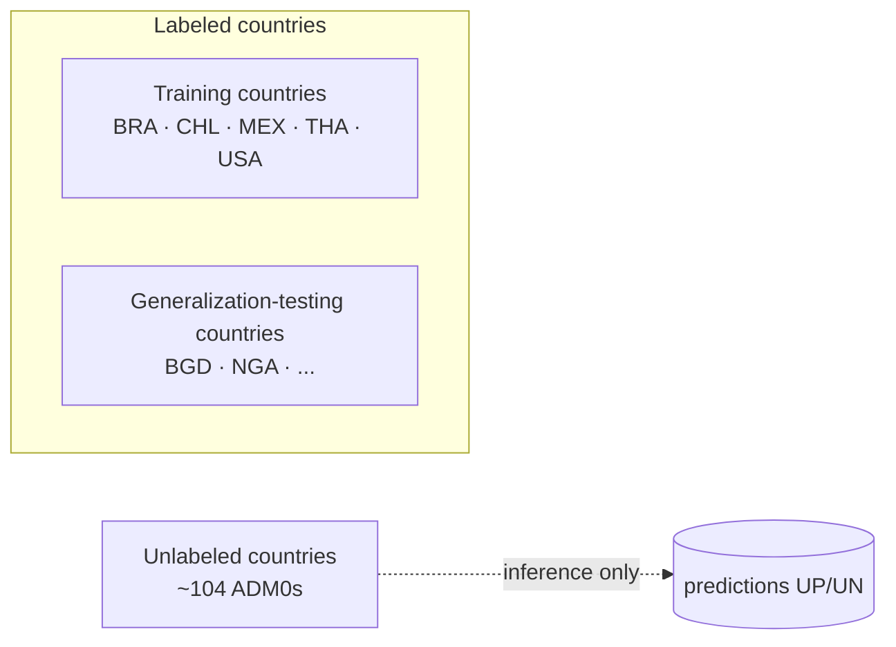
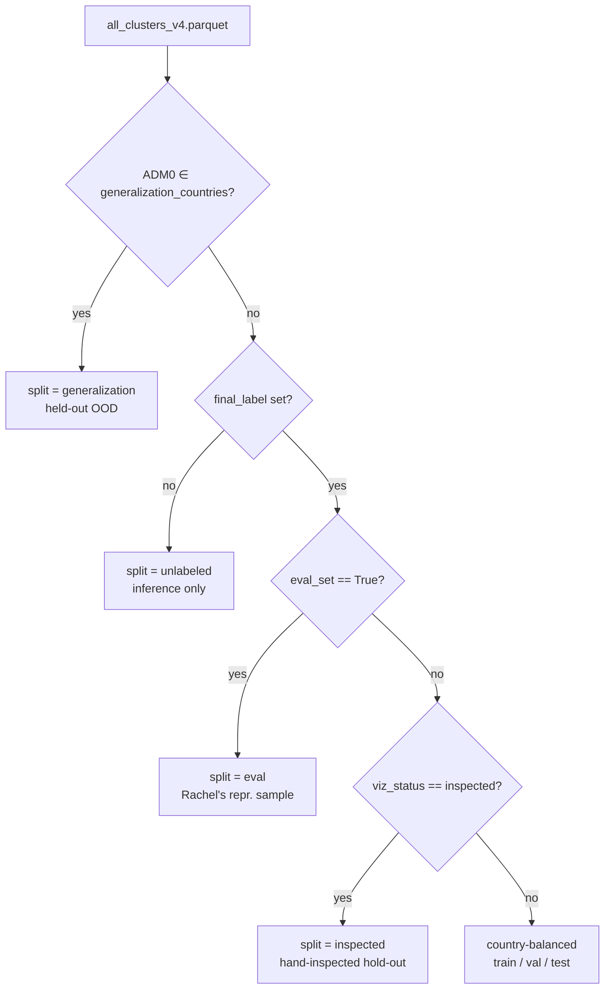

# Evaluation Framework

How the data is partitioned for model training, fitting and evaluation.

## Country roles

The labelled candidate pool is split into two role groups. Together they form
the **Labeled countries** set used for training, fitting, and evaluation.

### Training countries — `BRA, CHL, MEX, THA, USA`
Source: `{ISO}_selected_clusters_for_analysis.parquet` (Rachel's rebuilt files).
- **CNN**: split into `train` / `val` / `test` + an `eval` set (rows where
  `eval_set == True` — Rachel's representative-sample evaluation set; 100-150
  rows per country, never enters train).
- **Isolation Forest (IF)**: fitted on the USA-DMV subset only. Everything
  else inside the training countries (i.e. non-DMV USA plus all BRA, CHL, MEX,
  THA rows) is available for scoring the IF.

### Generalization-testing countries — `BGD, NGA` (extensible)
Source: same `{ISO}_selected_clusters_for_analysis.parquet` files.
- **CNN**: never enters train/val/test. Used as a held-out
  out-of-distribution slice. Reported as `generalization_metrics.json` and a
  per-country breakdown.
- **IF**: same held-out role — scored only, never fitted.

### Labeled countries — union of the above
This is the whole pool of clusters with `final_label` set (≈ 16-17k rows in
`all_clusters_v3.parquet`, plus the new BGD/NGA labels in `_v4`). It is the
basis for every reported metric.

## Splits inside the pipeline

The persisted `data/patches/splits/<config_stem>.csv` carries one column,
`split`, with values:
`train · val · test · inspected · eval · generalization · unlabeled · unknown`.

`inference.py` reads that file and attaches the split to each row of
`scored_candidates.parquet`, so the map and downstream analysis can colour
by split without re-deriving membership.

## Metrics produced per training run

For each model (binary / multiclass-7 / three-class):

| File | Slice |
|---|---|
| `training_metrics.json` | held-out **test** set (from training countries) |
| `inspected_metrics.json` | hand-inspected hold-out (training countries, `viz_status == inspected`) |
| `eval_metrics.json` | Rachel's **eval_set** representative sample (training countries) |
| `eval_metrics_per_country.json` | per-country breakdown of the eval set |
| `generalization_metrics.json` | held-out OOD countries (BGD, NGA, …) |
| `generalization_metrics_per_country.json` | per-country breakdown of OOD |

## Why this layout

- **CNN sanity check (training countries → test/val)**: cheap, standard.
- **CNN representative-sample (eval_set)**: removes test-distribution bias —
  benchmarked against the raw geometric-selection precision as a baseline.
- **CNN OOD (generalization countries)**: shows whether the model transfers
  to countries it never saw in training.
- **IF**: trained on the smallest clean poultry set (USA-DMV); every other
  labelled cluster is a test case for it.

## Implementation references

- Country routing: `data.generalization_countries: ["BGD", "NGA"]` field in
  the YAML config (see [training/config.py](../training/config.py)
  `DataConfig`).
- Split construction:
  [training/dataset.py:build_splits](../training/dataset.py).
- Metric emission:
  [training/train.py](../training/train.py)
  (`_write_per_country_metrics` and the generalization eval block).
- Master parquet rebuild that pulls in BGD/NGA:
  [scripts/merge_clusters_v3.py](../scripts/merge_clusters_v3.py) (with the
  generalization-country list added).
